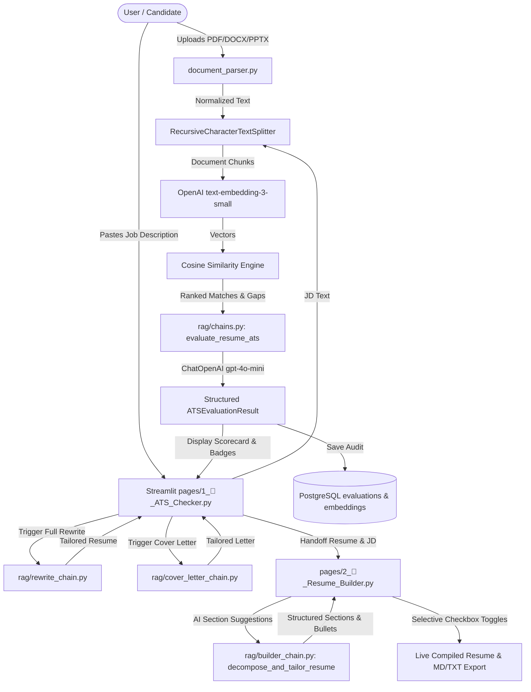

# Implementation Plan: RAG-based Resume ATS Checker with Streamlit, LangChain, OpenAI & PostgreSQL

Build an enterprise-grade, modular, RAG-powered Resume ATS (Applicant Tracking System) Checker application using **Streamlit**, **LangChain**, **OpenAI**, and **PostgreSQL**. The tool analyzes resumes against job descriptions, provides accurate ATS match scores, lists missing key skills/suggestions, generates a tailored full resume rewrite with regeneration capabilities, produces a personalized cover letter, and supports future template & export pages.

---

## 1. Technical Objectives & Requirements Breakdown

1. **RAG-Based ATS Checker Tool**:
   - Semantic chunking of candidate resumes and target job descriptions.
   - Vector embeddings using OpenAI (`text-embedding-3-small`).
   - Cosine similarity matching between candidate achievements and job requirements.
2. **LangChain & OpenAI**:
   - Structured JSON output parsing via Pydantic (`ATSEvaluationResult`).
   - Weighted scoring: Skills Match (45%), Experience Relevance (40%), ATS Formatting (15%).
   - Generative resume rewriting and tailored cover letter composition.
3. **Database (PostgreSQL)**:
   - Relational audit logging in `evaluations` table.
   - Vector embeddings in `resume_embeddings` (supporting both native `pgvector` and `JSONB` fallback).
4. **Multi-Format Ingestion**:
   - Seamless parsing for **PDF** (`pypdf`), **Word** (`python-docx`), and **PowerPoint** (`python-pptx`) documents with metadata tracking.
5. **Interactive UI (Streamlit)**:
   - Glassmorphic design with metric cards and keyword chips.
   - Suggestions box with actionable Google X-Y-Z recommendations.
   - Complete resume rewrite window with a **Regenerate** engine for alternative strategic angles.
   - Tailored cover letter space with copy/download features.
6. **Modularity & Future Expansion**:
   - Clean package layout under `src/resume_ats_checker/`.
   - Dedicated multi-page foundation (`pages/2_📝_Resume_Builder.py`) for visual resume templates, candidate photo placeholders, and PDF/DOCX exporters.

---

## 2. Directory & Modular Architecture

```
Resume ATS Checker/
├── .env                              # API keys, database settings, model config
├── .env.example                      # Committed sanitized template
├── pyproject.toml                    # UV project dependencies (Python >=3.11)
├── IMPLEMENTATION_PLAN.md            # Complete implementation plan & technical specs
├── WALKTHROUGH.md                    # Living walkthrough & feature tracking document
├── README.md                         # Project documentation, diagrams & guides
├── AGENTS.md                         # Workspace rules for synchronization
├── app.py                            # Streamlit entrypoint & dashboard
├── pages/
│   ├── 1_🎯_ATS_Checker.py           # Core ATS Checker & RAG Analyzer workspace
│   └── 2_📝_Resume_Builder.py        # Future expansion template & export studio
├── src/
│   └── resume_ats_checker/
│       ├── __init__.py
│       ├── config.py                 # Pydantic Settings & environment loader
│       ├── database/
│       │   ├── __init__.py
│       │   ├── connection.py         # PostgreSQL connection pool & schema creation
│       │   └── repository.py         # Evaluation history & embeddings CRUD operations
│       ├── parsers/
│       │   ├── __init__.py
│       │   └── document_parser.py    # Multi-format parser (PDF, DOCX, PPTX, TXT)
│       ├── rag/
│       │   ├── __init__.py
│       │   ├── vectorstore.py        # Chunking, embeddings & RAG similarity retrieval
│       │   ├── chains.py             # LangChain structured ATS evaluation
│       │   ├── rewrite_chain.py      # Complete tailored resume rewrite & regeneration
│       │   ├── cover_letter_chain.py # Persuasive tailored cover letter generator
│       │   └── builder_chain.py      # Structured resume decomposition & suggestion engine
│       ├── ui/
│       │   ├── __init__.py
│       │   ├── styles.py             # Glassmorphic CSS tokens, typography, and dark palette
│       └── components.py             # Reusable UI metric cards, chips, and callouts
│       └── utils/
│           ├── __init__.py
│           └── exporter.py           # Multi-format resume exporter (Word .docx, PDF .pdf, Text .txt)
└── tests/
    └── test_suite.py                 # Automated verification test suite
```

---

## 3. End-to-End Component Flow



---

## 4. Module Specifications

### A. Document Parser (`src/resume_ats_checker/parsers/document_parser.py`)
- **Functions**: `parse_document()`, `parse_pdf()`, `parse_docx()`, `parse_pptx()`, `clean_text()`.
- **Inputs**: File name, raw file byte stream.
- **Outputs**: Cleaned plain text string, metadata dictionary (format, counts).

### B. RAG Engine (`src/resume_ats_checker/rag/vectorstore.py`)
- **Functions**: `chunk_text()`, `cosine_similarity()`, `perform_rag_analysis()`.
- **Inputs**: Resume text, Job Description text.
- **Outputs**: List of requirement-to-evidence matches, mean similarity score.

### C. ATS Evaluation Chain (`src/resume_ats_checker/rag/chains.py`)
- **Schema**: `ATSEvaluationResult` (Pydantic model).
- **Functions**: `evaluate_resume_ats()`.
- **Inputs**: Resume text, Job Description text, RAG matches.
- **Outputs**: Validated scores (Overall, Skills, Experience, Formatting), summary, keyword lists, suggestions.

### D. Resume Rewrite Engine (`src/resume_ats_checker/rag/rewrite_chain.py`)
- **Functions**: `generate_suggested_resume()`.
- **Inputs**: Original resume text, Job Description, missing keywords, variation focus.
- **Outputs**: Formatted complete Markdown resume.

### E. Cover Letter Generator (`src/resume_ats_checker/rag/cover_letter_chain.py`)
- **Functions**: `generate_cover_letter()`.
- **Inputs**: Resume text, Job Description, candidate name.
- **Outputs**: Persuasive Markdown cover letter.

### F. Structured Resume Builder Engine (`src/resume_ats_checker/rag/builder_chain.py`)
- **Schemas**: `WorkExperienceEntry`, `EducationEntry`, `ProjectEntry`, `StructuredResume`.
- **Functions**: `decompose_and_tailor_resume()`, `generate_default_sample_resume()`.
- **Inputs**: Raw resume text, target Job Description.
- **Outputs**: Strongly typed `StructuredResume` with tailored bullets, summary, and categorized skills.

### G. Interactive Accordion Resume Builder (`pages/2_📝_Resume_Builder.py`)
- **Features**: Accordion section checklists (`Contact Information`, `Target Title`, `Professional Summary`, `Work Experience`, `Education`, `Skills & Interests`, `Certifications`, `Projects`, `Awards`, `Leadership`, `Publications`).
- **Functionality**:
  - Context handoff from ATS Checker or standalone upload/paste.
  - Granular checkboxes next to each bullet point, role, and credential.
  - Live compiled Markdown and plain text resume preview with instant export downloads.

### H. Database Persistence (`src/resume_ats_checker/database/`)
- **Modules**: `connection.py` (engine & table DDL), `repository.py` (CRUD helpers).
- **Tables**: `evaluations`, `resume_embeddings`.

### I. Multi-Format Document Exporter (`src/resume_ats_checker/utils/exporter.py`)
- **Modules**: `exporter.py`
- **Functions**: `generate_docx_from_structured_resume()`, `generate_pdf_from_structured_resume()`, `generate_txt_from_structured_resume()`, `generate_docx_from_markdown()`, `generate_pdf_from_markdown()`.
- **Inputs**: `StructuredResume` object or Markdown string, selection dictionary, candidate name.
- **Outputs**: Formatted `.docx` byte stream, publication-grade `.pdf` byte stream, clean `.txt` ASCII string.
- **Dependencies**: `python-docx`, `reportlab`.

---

## 5. Verification & Test Plan

1. **Automated Tests**:
   - Verified multi-format document parser using synthesized PDF, DOCX, and PPTX byte streams.
   - Verified PostgreSQL connection and table operations on port 5432.
   - Verified `StructuredResume` schema and default sample data generation in `tests/test_suite.py`.
   - Verified multi-format document exporter generating Word (`.docx`), PDF (`.pdf`), and Text (`.txt`) streams without errors.
2. **Syntax Validation**:
   - Verified zero compilation/syntax errors across all Python files.
3. **Execution**:
   - Ran live Streamlit server on `http://localhost:8501` verifying healthy HTTP 200 response and multi-page routing.

