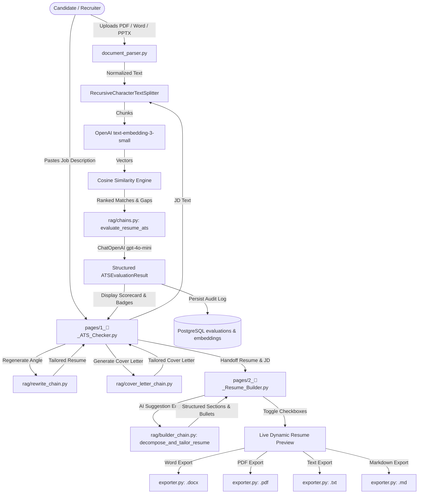

# Resume ATS Checker - End-to-End Walkthrough & Feature Guide

This walkthrough document tracks all features, capabilities, user workflows, and architectural components built in the **Resume ATS Checker** application. It serves as an active living guide and will be continually updated as new features are added.

---

## 📋 Table of Contents
1. [System Overview & Architecture](#1-system-overview--architecture)
2. [Module Breakdown](#2-module-breakdown)
3. [Feature Walkthrough](#3-feature-walkthrough)
   - [Feature 1: Multi-Format Document Ingestion](#feature-1-multi-format-document-ingestion)
   - [Feature 2: RAG-Powered ATS Scoring & Match Analysis](#feature-2-rag-powered-ats-scoring--match-analysis)
   - [Feature 3: Strategic Complete Resume Rewriting & Regeneration](#feature-3-strategic-complete-resume-rewriting--regeneration)
   - [Feature 4: Tailored Cover Letter Generator](#feature-4-tailored-cover-letter-generator)
   - [Feature 5: Interactive Structured Resume Builder](#feature-5-interactive-structured-resume-builder)
   - [Feature 6: Multi-Format Exporter (Word / PDF / Text / Markdown)](#feature-6-multi-format-exporter-word--pdf--text--markdown)
   - [Feature 7: PostgreSQL Audit Logging & Vector Store](#feature-7-postgresql-audit-logging--vector-store)
4. [Automated Verification & Test Suite](#4-automated-verification--test-suite)
5. [Maintenance Protocol: Keeping This Walkthrough Updated](#5-maintenance-protocol-keeping-this-walkthrough-updated)

---

## 1. System Overview & Architecture

The application is built with a modular, enterprise-grade architecture:



### Core Technologies:
- **Frontend / UI**: [Streamlit](https://streamlit.io/) with custom glassmorphism styles, responsive columns, and real-time session state management.
- **LLM Orchestration**: [LangChain](https://www.langchain.com/) with OpenAI `gpt-4o-mini` and `text-embedding-3-small`.
- **Database**: PostgreSQL 18 with relational tables and vector embeddings support.
- **Document Processing**: `pypdf`, `python-docx`, `python-pptx`, and `reportlab`.

---

## 2. Module Breakdown

```
Resume ATS Checker/
├── app.py                                # Streamlit entrypoint, navigation & executive dashboard
├── pages/
│   ├── 1_🎯_ATS_Checker.py              # Core ATS Checker & RAG analysis workspace
│   └── 2_📝_Resume_Builder.py           # Interactive Accordion Resume Builder & export studio
├── src/
│   └── resume_ats_checker/
│       ├── config.py                    # Environment settings loaded via Pydantic
│       ├── database/
│       │   ├── connection.py            # PostgreSQL connection pool & automatic table schema creation
│       │   └── repository.py            # Database CRUD operations for evaluations and embeddings
│       ├── parsers/
│       │   └── document_parser.py       # Robust ingestion for PDF, DOCX, PPTX, and TXT files
│       ├── rag/
│       │   ├── vectorstore.py           # Chunking, vector embedding, and cosine similarity matching
│       │   ├── chains.py                # LangChain ATS scoring chain with Pydantic output validation
│       │   ├── rewrite_chain.py         # Full resume rewrite engine with 4 strategic angles
│       │   ├── cover_letter_chain.py    # Persuasive, tailored cover letter generator
│       │   └── builder_chain.py         # Resume decomposition & bullet generation into StructuredResume
│       ├── ui/
│       │   ├── styles.py                # Glassmorphism dark mode CSS tokens & styling
│       │   └── components.py            # Reusable UI cards, skill chips, and metric gauges
│       └── utils/
│           └── exporter.py              # Document exporter generating Word (.docx), PDF (.pdf), Text (.txt)
├── tests/
│   └── test_suite.py                    # Automated verification test suite
├── IMPLEMENTATION_PLAN.md               # Technical design specifications
├── README.md                            # Comprehensive project overview & documentation
├── WALKTHROUGH.md                       # Living walkthrough & feature tracking document
└── AGENTS.md                            # Workspace synchronization rules
```

---

## 3. Feature Walkthrough

### Feature 1: Multi-Format Document Ingestion
- **Location**: [`src/resume_ats_checker/parsers/document_parser.py`](file:///c:/Debaranjan/Git_Projects/Resume%20ATS%20Checker/src/resume_ats_checker/parsers/document_parser.py)
- **Supported Formats**:
  - **PDF (`.pdf`)**: Extracted page by page via `pypdf.PdfReader` with whitespace normalization.
  - **Word (`.docx`)**: Paragraphs, section headers, and cell contents from embedded tables extracted via `python-docx`.
  - **PowerPoint (`.pptx`)**: Text frames, candidate portfolio slide decks, and speaker notes extracted via `python-pptx`.
  - **Plain Text (`.txt`)**: Clean Unicode ingestion.
- **Safety**: Validates file streams, strips null bytes, and generates diagnostic metadata (word count, character count, format).

### Feature 2: RAG-Powered ATS Scoring & Match Analysis
- **Location**: [`src/resume_ats_checker/rag/`](file:///c:/Debaranjan/Git_Projects/Resume%20ATS%20Checker/src/resume_ats_checker/rag/) & [`pages/1_🎯_ATS_Checker.py`](file:///c:/Debaranjan/Git_Projects/Resume%20ATS%20Checker/pages/1_%F0%9F%8E%AF_ATS_Checker.py)
- **Workflow**:
  1. Semantic Chunking: Resume and Job Description are divided into overlapping chunks via `RecursiveCharacterTextSplitter`.
  2. Embeddings & Similarity: Chunks are vectorized using OpenAI `text-embedding-3-small`. Cosine similarity identifies exact requirement-to-experience alignments and flags gaps.
  3. Weighted ATS Scoring:
     - **Skills Match (45%)**: Coverage of must-have tools, programming languages, and certifications.
     - **Experience Relevance (40%)**: Alignment between past job responsibilities and JD expectations.
     - **ATS Formatting (15%)**: Readability, standard headers, and bullet clarity.
  4. Visual Scorecard: Overall ATS score rendered with a color-coded circular gauge, metric delta cards, missing keyword warning chips, identified strengths, and actionable Google X-Y-Z format recommendations ("Accomplished [X] as measured by [Y], by doing [Z]").

### Feature 3: Strategic Complete Resume Rewriting & Regeneration
- **Location**: [`src/resume_ats_checker/rag/rewrite_chain.py`](file:///c:/Debaranjan/Git_Projects/Resume%20ATS%20Checker/src/resume_ats_checker/rag/rewrite_chain.py)
- **Workflow**:
  - Under **Tab 3 ("Suggested Complete Resume")**, a full, ATS-optimized rewrite of the candidate's resume is rendered in clean Markdown.
  - **Multi-Angle Regeneration**: Users can choose from 4 strategic perspectives and click **"🔄 Regenerate Resume"**:
    1. *Targeted ATS Optimization*: Maximum keyword density and direct phrase matching.
    2. *Executive & Leadership Impact*: Strategic leadership, business ROI, and stakeholder influence.
    3. *Technical & Architectural Depth*: In-depth system design, frameworks, algorithms, and infrastructure.
    4. *Metric-Heavy & Data-Driven*: Quantified achievements, percentages, scale, and performance gains.
  - Updates are saved directly to the database audit record.

### Feature 4: Tailored Cover Letter Generator
- **Location**: [`src/resume_ats_checker/rag/cover_letter_chain.py`](file:///c:/Debaranjan/Git_Projects/Resume%20ATS%20Checker/src/resume_ats_checker/rag/cover_letter_chain.py)
- **Workflow**:
  - Under **Tab 4 ("Tailored Cover Letter")**, users can click **"✨ Generate Tailored Cover Letter"**.
  - Synthesizes candidate strengths with specific target company requirements into a compelling 3-4 paragraph pitch.
  - One-click copy/download in plain text or Markdown.

### Feature 5: Interactive Structured Resume Builder
- **Location**: [`pages/2_📝_Resume_Builder.py`](file:///c:/Debaranjan/Git_Projects/Resume%20ATS%20Checker/pages/2_%F0%9F%93%9D_Resume_Builder.py) & [`src/resume_ats_checker/rag/builder_chain.py`](file:///c:/Debaranjan/Git_Projects/Resume%20ATS%20Checker/src/resume_ats_checker/rag/builder_chain.py)
- **Two Entry Modes**:
  1. **Cross-Navigation from ATS Checker**: When navigating via **"🛠️ Customize in Interactive Resume Builder"**, the candidate's resume text and target JD are automatically loaded.
  2. **Standalone Mode**: Candidates can upload any reference resume, paste a target JD, and trigger AI decomposition, or load pre-populated sample data.
- **Accordion Checklists**:
  - `> Contact Information`: Full Name, Target Title, Email, Phone, Location, Portfolio Links.
  - `> Target Title`: Suggested target role headline.
  - `> Professional Summary`: Editable summary with an inclusion toggle.
  - `> Work Experience`: Company name, role title, dates, location, and **individual checkboxes next to each achievement bullet point**.
  - `> Education`: School, degree, location, dates, and inclusion checkboxes.
  - `> Skills & Interests`: Categorized technical languages, frameworks, and cloud tools.
  - `> Certifications`, `> Projects`, `> Awards`, `> Leadership`, `> Publications`.
- **Live Dynamic Preview Drawer**:
  - A real-time Markdown preview updates instantly as users check or uncheck individual bullets or entire sections.

### Feature 6: Multi-Format Exporter (Word / PDF / Text / Markdown)
- **Location**: [`src/resume_ats_checker/utils/exporter.py`](file:///c:/Debaranjan/Git_Projects/Resume%20ATS%20Checker/src/resume_ats_checker/utils/exporter.py)
- **Available Formats**:
  1. **Word (`.docx`)**:
     - Built with `python-docx`.
     - Standard 0.75-inch margins, Calibri font, navy section headers with bottom borders, bold positions/companies, italic dates/locations, and native Word bullet lists.
  2. **PDF (`.pdf`)**:
     - Built with `reportlab.platypus` (`SimpleDocTemplate`, `Paragraph`, `HRFlowable`, `Spacer`).
     - Vector layout, crisp lines, clean page breaking, and zero external GTK/Pango C-library dependencies on Windows.
  3. **Plain Text (`.txt`)**:
     - Clean ASCII representation with section dividers (`-----`) and bullet points (`•`) for direct paste into legacy ATS portals.
  4. **Markdown (`.md`)**:
     - Clean markdown output for GitHub portfolios and personal sites.
- **Available On**:
  - Both the **Interactive Resume Builder** (exporting user-checked selections) and the **ATS Checker** (exporting rewritten complete resumes).

### Feature 7: PostgreSQL Audit Logging & Vector Store
- **Location**: [`src/resume_ats_checker/database/`](file:///c:/Debaranjan/Git_Projects/Resume%20ATS%20Checker/src/resume_ats_checker/database/)
- **Tables**:
  - `evaluations`: Stores candidate name, filenames, scores, matched keywords, missing keywords, rewritten resumes, and cover letters.
  - `resume_embeddings`: Stores chunk embeddings supporting native `pgvector` or standard `JSONB` fallback.
- **Auto-Initialization**: Schema and tables are created automatically on startup.

---

## 4. Automated Verification & Test Suite

The comprehensive test suite is located in [`tests/test_suite.py`](file:///c:/Debaranjan/Git_Projects/Resume%20ATS%20Checker/tests/test_suite.py).

### How to Run:
```bash
uv run python tests/test_suite.py
```

### Verified Test Matrix:
| Test Component | Purpose | Verification Result |
| :--- | :--- | :---: |
| `test_pdf_parsing` | Validates `pypdf` extraction on binary streams | `PASSED` |
| `test_docx_parsing` | Validates `python-docx` heading & body extraction | `PASSED` |
| `test_pptx_parsing` | Validates `python-pptx` presentation extraction | `PASSED` |
| `test_database_integration` | Validates PostgreSQL 18 connection, DDL & CRUD | `PASSED` |
| `test_builder_schema` | Validates Pydantic `StructuredResume` schema | `PASSED` |
| `test_exporter` | Validates Word, PDF, and Text byte generation | `PASSED` |

---

## 5. Maintenance Protocol: Keeping This Walkthrough Updated

Whenever new features, pages, database changes, or export capabilities are added:
1. **Append/Update Features**: Add the new feature details under Section 3 with exact file links, inputs, outputs, and UI interactions.
2. **Update Architecture Diagram**: Update the Mermaid diagram in Section 1 to reflect any newly introduced nodes or data paths.
3. **Update Test Matrix**: Document any new automated tests added to `tests/test_suite.py`.
4. **Synchronize with Documentation**: Ensure changes are concurrently documented in `README.md`, `IMPLEMENTATION_PLAN.md`, and committed to git.
